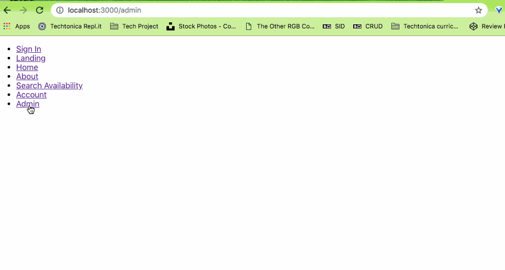

Let's build an app that has authentication, authorization, and a database using React with Firebase. 
===========
Built up from [Robin Wieruch](https://www.robinwieruch.de/complete-firebase-authentication-react-tutorial/) tutorial.


````
npx create-react-app firebase-authentication
cd firebase-authentication
npm start
````

remove all boilerplate info don't need in react-app template
````
cd src
rm App.js App.test.js App.css logo.svg
````

create component directory
````
mkdir components
cd components
````

create components: 
````
mkdir Account Admin App Home Landing SignIn SignOut SignUp
mkdir Navigation PasswordChange PasswordForget
mkdir Session Firebase
````

create an index.js file for each folder within component (go into directory, create file, go out of directory)
````
cd <component_dir_name>
touch index.js
cd ..
````

Create basic components in each index.js with component name the same as its directory. Be sure to import react and export the component.


Edit the path to App component in the src/index.js file which is now in src/components directory


Determine which routes will be unprotected and protected with authentication needs. Create multiple pages by exporting multiple URLs in routes.js; one for each page: 
`export const PAGE_NAME = '/page_url_name';`
Map routes to React components using React Router package:
`npm install react-router-dom`

App Component: 
Fixed Components (navigation, side bar, footer) and Display of Route Based Pages (account, login, password forget, etc) using the Router url-to-url without submitting new requests for each route.
*"The application is only fetched once from a web server, after which all routing is done on the client-side with React Router."

Navigation Component:
Import the Navigation Component from it's directory and BrowserRouter as Router into your App component. Nest your Navigation component inside the Router by replace the divs and text with the following: 
````
  <Router>
    <Navigation />
  </Router>
````

Link Component: 
Import Link component from the router-dom to Navigation component. Import the routes in from the routes file. Replace the div and text with an unordered list with Link components for each page. This will allow you to switch between URLs, but not change content until officially using the React Router.

````
import { Link } from 'react-router-dom';
import * as ROUTES from '../../constants/routes';

<ul>
    <li>
        <Link to={ROUTES.Page_Name_Variable_From_routes_file}>Clickable_Link_Page_Name</Link>
    </li>
</ul>
````

URL to URL: 

Route Component:
Import components  in from directories to App component. Import the routes in from the routes file. Add imported Route to router-dom. Place route paths under the Navigation component. This will make the url routes match the paths displaying the respective components.

*NOTE: Navigation component still remains independently fixed. The dynamic pages are driven by the url route paths which the Route component points to their component content. Clicking the navigation links will give a changing display based on respective component content.
````
import { BrowserRouter as Router, Route } from 'react-router-dom';

//under navigation
<Route path={ROUTES.Page_Name_Variable_From_routes_file} component={component_variable_name_from_index.js}/
````

Route (URL to Component) Navigation: 


